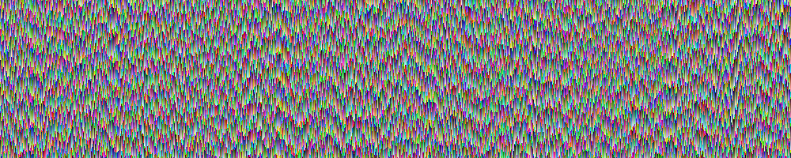

# Procedural image generator

This tiny project is a procedural image generator that starts with a random top
row of pixels, and iteratively generates the rows below according to some rule.
Each row depends only on the row immediately above.

## Available rules

1. *Primitive 1-to-1.*
   Pixel's RGB values are jittered RGB values of the pixel above.
   
2. *Genetic, 2 parents.*
   Each pixel has 2 parents: dad (above left) and mom (above right). R, G, and
   B values are genes. Alleles are chosen randomly and independently from mom
   or dad and jittered (think inheritance with mutation).
   
3. *Genetic, 3 parents.*
   Each pixel has the pixel immediately above as third parent in addition to
   'mom' and 'dad' from 2.
   
4. *Averaging, 2 parents.*
   RGB values of pixel are averaged mom and dad's RGB values with some random
   noise added.
   
5. *Averaging, asymmetric, 2 parents.*
   Same as 2, except dad is directly above, mom is above right.
   

## Usage

Clone repo, then:

```bash
make
```
This produces the `row_by_row` executable, which takes 4 mandatory parameters:
`width` in pixels, `height` in pixels, `strategy` (1-5, per numbering above),
and `filename` where the image is saved. The output is in PPM format.

For example:

```bash
./row_by_row 2880 1800 2 image.ppm
```
